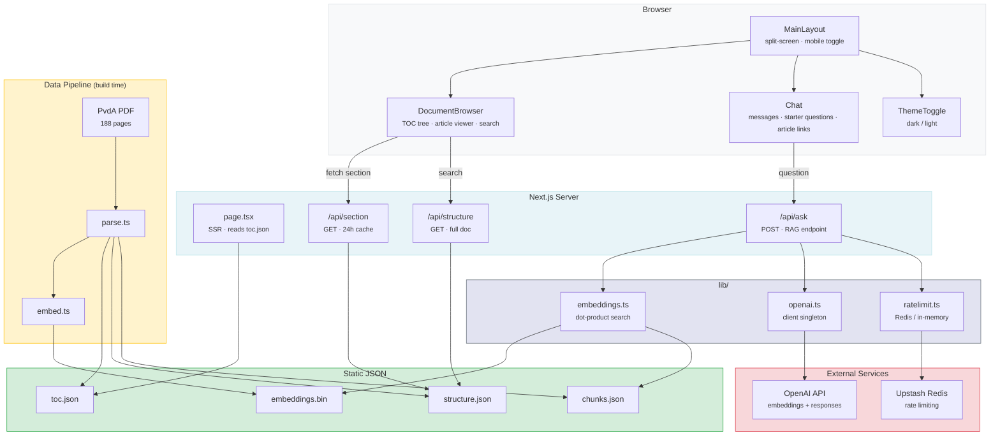

<p align="center">
  <strong>Pvd<em>AI</em></strong>
</p>

<p align="center">
  AI-powered document browser for the articles of association of the Dutch Labour Party (PvdA).
</p>

<p align="center">
  <a href="https://pvdai.tech"><strong>pvdai.tech</strong></a>
</p>

<p align="center">
  <a href="https://pvdai.tech"></a>
  
  
  <br />
  
  
  
  
</p>

---

Party statutes are long, dense, and written in legal Dutch. PvdAI lets members ask questions in plain language and get answers they can actually understand.

PvdAI makes the 188-page [Statuten en reglementen PvdA 2023](https://www.pvda.nl/wp-content/uploads/2017/06/Statuten-en-reglementen-PvdA-2023.pdf) accessible through a split-screen interface: a **document browser** on the left and an **AI chat** on the right. Ask questions in plain language and get answers at B1 reading level with references to specific articles.


## Features

- **RAG-powered Q&A** — answers grounded in the actual document via semantic search over embeddings
- **Conversational context** — follow-up questions use conversation history with automatic query rewriting
- **Interactive document browser** — collapsible table of contents with on-demand section loading
- **Document search** — full-text search with text snippet previews and highlighted matches
- **Clickable article references** — AI responses link directly to referenced articles in the browser (including plural "Artikelen X, Y, Z" references)
- **Copy & share** — copy or share AI responses directly from the chat
- **Shareable questions** — link to a question via URL query parameter for auto-submission on load
- **Dark/light mode** — system-aware with manual toggle
- **Mobile-first** — responsive panel switching with accessible touch targets
- **Accessible** — WCAG AA contrast compliance, 44px touch targets, `prefers-reduced-motion` support, `aria-live` announcements, focus-visible styles, and `inert` attribute on hidden panels
- **SEO-friendly** — server-rendered summary and TOC, sitemap, robots.txt, IndexNow, FAQPage schema, SearchAction, canonical URL; dedicated `/veelgestelde-vragen` and `/privacybeleid` pages
- **Privacy-first** — questions not stored or used for training (`store: false`); IP addresses HMAC-SHA256 hashed with daily rotation before storage; GA4 advertising features disabled
- **Rate limiting** — 20 questions/day per IP via Redis (Vercel/Upstash), with remaining count shown to users; IPs stored only as HMAC hashes
- **Error handling** — custom 404 page, error boundaries, incomplete stream detection

## Tech Stack

| Layer | Technology |
|-------|-----------|
| Framework | [Next.js](https://nextjs.org) 16 (App Router) |
| UI | [React](https://react.dev) 19, SCSS Modules |
| AI | [OpenAI](https://platform.openai.com) SDK — `text-embedding-3-small` + Responses API |
| Language | TypeScript 5 |
| Hosting | [Vercel](https://vercel.com) |
| Rate Limiting | [Redis](https://redis.io) via Upstash (in-memory fallback for local dev) |
| Testing | [Vitest](https://vitest.dev) |
| CI | [GitHub Actions](.github/workflows/ci.yml) — lint + test on push/PR |
| Database | None — static JSON files |

## Quick Start

```sh
git clone https://github.com/julianaijal/PvdAI.git
cd PvdAI
cp .env.example .env.local   # then add your OpenAI API key
npm install
npm run dev
```

Open [http://localhost:3000](http://localhost:3000).

### Environment Variables

| Variable | Required | Description |
|----------|----------|-------------|
| `OPENAI_API_KEY` | Yes | [OpenAI API key](https://platform.openai.com/api-keys) |
| `REDIS_URL` | No | Upstash Redis URL. Falls back to in-memory rate limiting |
| `IP_HASH_SECRET` | Yes (prod) | Secret key for HMAC-SHA256 IP hashing. Generate with `openssl rand -hex 32` |

### Data Pipeline

The project uses static JSON instead of a database. Run these once:

```sh
# 1. Parse the PDF into structured data
npx tsx scripts/parse.ts
# Output: data/structure.json, data/toc.json, data/chunks.json

# 2. Generate vector embeddings for semantic search
npx tsx scripts/embed.ts
# Output: data/embeddings.bin + data/embeddings.meta.json (gitignored)
```

### Running Tests

```sh
npm test
```

### Production Build

```sh
npm run build   # runs embed.ts as prebuild step, then next build
```

### Content Update

When the source PDF changes:

```sh
npm run content-update   # parse + embed + notify search engines via IndexNow
```

## Architecture



### Project Structure

```
app/
├── page.tsx                     Server component — reads toc.json at build time
├── layout.tsx                   Root layout with metadata and theme setup
├── globals.scss                 CSS variables, PvdA branding, dark/light themes
├── robots.ts                    Dynamic robots.txt
├── sitemap.ts                   Dynamic sitemap
├── api/
│   ├── ask/route.ts             POST — RAG endpoint (embed → search → respond)
│   ├── section/route.ts         GET  — on-demand section content (24h cache)
│   └── structure/route.ts       GET  — full structure.json for client-side search
├── components/
│   ├── MainLayout/              Split-screen layout, mobile panel toggle
│   ├── DocumentBrowser/         Collapsible TOC tree, article viewer, document search
│   ├── Chat/                    Message history, starter questions, copy/share, article links
│   └── ThemeToggle/             Dark/light mode switch
lib/
├── openai.ts                    OpenAI client singleton
├── embeddings.ts                Dot-product search over L2-normalized vectors
├── ratelimit.ts                 Redis rate limiter with in-memory fallback (20/day)
└── schemas.ts                   Zod schemas for API request validation
scripts/
├── parse.ts                     PDF → structured JSON (pure JS, no system deps)
├── embed.ts                     Chunks → binary vector embeddings (runs at build time)
└── indexnow.ts                  Notify search engines of content changes
tests/                           Unit tests (Vitest)
.github/workflows/ci.yml        CI pipeline (lint + test on push/PR)
data/                            Generated data files (embeddings gitignored)
```

### How RAG Works

1. User question is embedded with `text-embedding-3-small`
2. For follow-up questions, the query is automatically rewritten using conversation history for better context
3. Top 5 chunks found via dot-product search against L2-normalized embeddings
4. Chunks + question sent to OpenAI Responses API with a Dutch B1-level system prompt
5. Response streamed back as SSE; article references become clickable links in the UI

## API Reference

### `POST /api/ask`

Ask a question about the articles of association.

**Request:**
```json
{
  "question": "Hoe word ik lid van de PvdA?",
  "history": []
}
```

**Response** (SSE stream):
```
data: {"delta": "Je kunt lid worden als je 16 jaar of ouder bent..."}
data: [DONE]
```

**Headers:** `X-RateLimit-Remaining` — questions left today.

**Errors:**

| Status | Body | Cause |
|--------|------|-------|
| `400` | `{"error": "..."}` | Invalid request (missing/malformed question) |
| `429` | `{"error": "Je hebt het maximum aantal vragen voor vandaag bereikt..."}` | Rate limit exceeded (20/day per IP) |
| `500` | `{"error": "Er is een fout opgetreden bij het verwerken van je vraag."}` | Internal server error |

### `GET /api/section?id=<section-id>`

Load section content on demand.

**Response:** Full section object with nested children. Cached for 24 hours via `Cache-Control`.

### `GET /api/structure`

Returns the full document structure for client-side search.

## Privacy

- Questions are **not stored** and **not used for AI training** — OpenAI API called with `store: false`
- IP addresses are **never stored in plaintext** — hashed with HMAC-SHA256 (server secret + daily date) before Redis storage; hashes expire after 24h and rotate daily
- GA4 advertising features disabled (`allow_google_signals: false`, `allow_ad_personalization_signals: false`)
- Full details at [pvdai.tech/privacybeleid](https://pvdai.tech/privacybeleid)

## Contributing

Contributions are welcome. Please open an issue first to discuss what you'd like to change.

## License

This project is licensed under the [MIT License](LICENSE).

## Disclaimer

PvdAI is an independent open-source project. It is not affiliated with, endorsed by, or an official product of the Partij van de Arbeid (PvdA). AI-generated answers may contain inaccuracies. Always consult the [official document](https://www.pvda.nl/wp-content/uploads/2017/06/Statuten-en-reglementen-PvdA-2023.pdf) for authoritative information.
